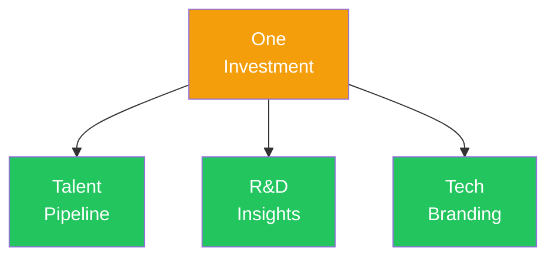

# 一つの投資で三つのリターン

<!--
Speaker Notes:
スポンサーシップの投資対効果を整理しましょう。第一に「人材発掘」です。世界水準のカリキュラムで育成された人材と、御社の課題解決を通じて早期に接触できます。彼らが就職活動を始める前に、御社を認知し、御社の課題を理解した状態を作れるのです。第二に「ユースケース創出」です。テーマ提案権を通じて、御社が探索したい領域に参加者が取り組みます。その成果から、実用化に向けたヒントや方向性を得られる可能性があります。研究開発の外部委託と考えれば、非常にコストパフォーマンスの高い投資です。第三に「技術ブランディング」です。ZK Core Programへの協賛は、御社が先端暗号技術の人材育成を支援する企業であることを対外的に示すことになります。エンジニア採用市場において、このような技術ブランディングは大きな差別化要因となります。つまり、一つの投資で人材・研究開発・ブランディングという複数のROIチャネルを同時に獲得できるのです。
-->
