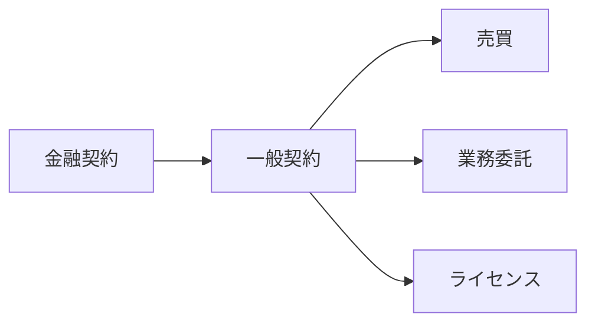

# 🕹️ ユースケース：契約の拡張

::right::

**課題**
- 金融以外の契約設計が未成熟
- 社会制度との接続が弱い

**取り組み事例**
- リアルワールドアセットの実験
- オンチェーン契約管理の試行

**研究テーマ**
- 契約理論：インセンティブと自動執行
- 法学×暗号：境界条件の設計

<!--
Speaker Notes:
イーサリアムは金融以外にも、売買・業務委託・ライセンスといった一般契約へ拡張できます。ここでは契約理論や法学との接続が鍵になります。研究者の知見が直接価値になる領域です。
-->
