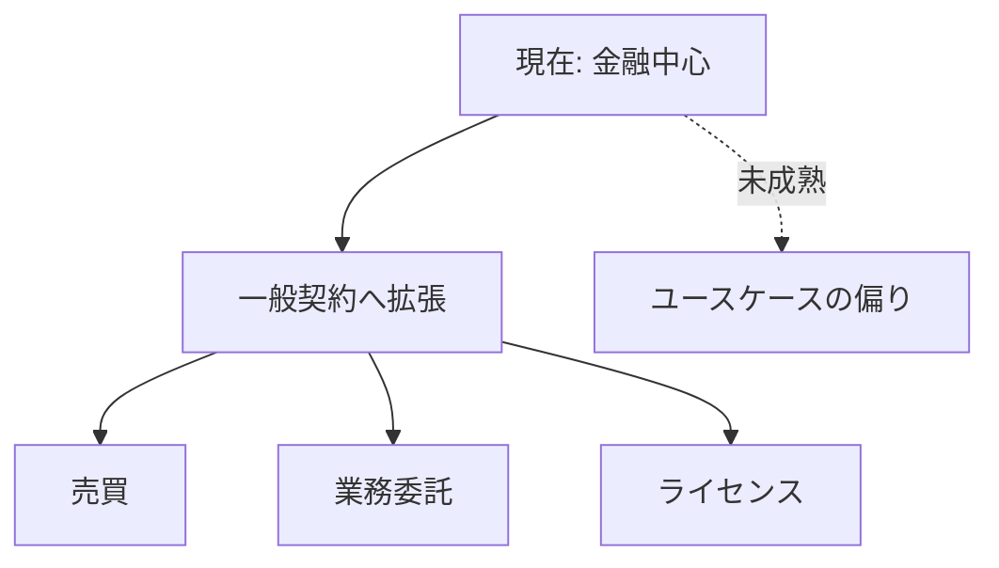

# 🕹️ ユースケース：契約の拡張

  

    

    

  

  

<strong>課題</strong>

<ul>
  <li>金融以外の契約設計が未成熟</li>
  <li>社会制度との接続が弱い</li>
</ul>

<strong>取り組み事例</strong>

<ul>
  <li>リアルワールドアセットの実験</li>
  <li>オンチェーン契約管理の試行</li>
</ul>

<strong>研究テーマ</strong>

<ul>
  <li>契約理論：インセンティブと自動執行</li>
  <li>法学×暗号：境界条件の設計</li>
</ul>

<!--
Speaker Notes:
イーサリアムは金融以外にも、売買・業務委託・ライセンスといった一般契約へ拡張できます。ここでは契約理論や法学との接続が鍵になります。研究者の知見が直接価値になる領域です。
-->
