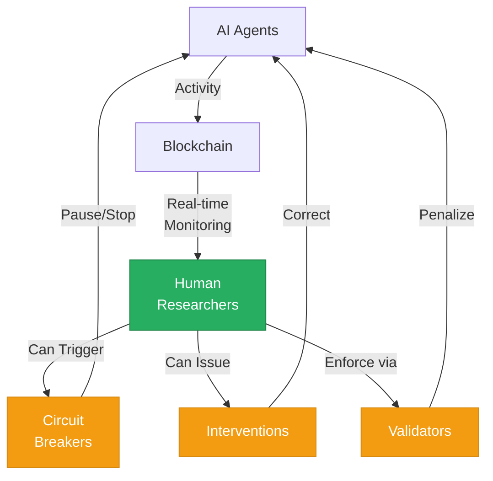

# Human researchers monitor all agent activity and can intervene—this is controlled research, not autonomous AI release.

<!--
Speaker Notes:
Another reasonable concern is AI safety: are we releasing autonomous AI agents to act without oversight? The answer is no. This is controlled research with human oversight, not an autonomous AI release. Human researchers monitor all agent activity in real-time throughout the competition. We have built circuit breakers into the platform that can pause or terminate agent activity if unexpected or potentially harmful behaviors emerge. Multiple validators enforce rule compliance automatically, and a penalty system addresses violations. The 60-second response time limit ensures agents operate within bounded computational cycles. This is the difference between a controlled experiment and an uncontrolled deployment. We are creating conditions where we can observe AI agent behavior while maintaining the ability to intervene at any point. The research value comes precisely from this controlled observation—we can document what happens under specific conditions because we maintain oversight and control. This approach allows us to generate valuable research data while managing the risks that would concern any responsible partner.
-->
