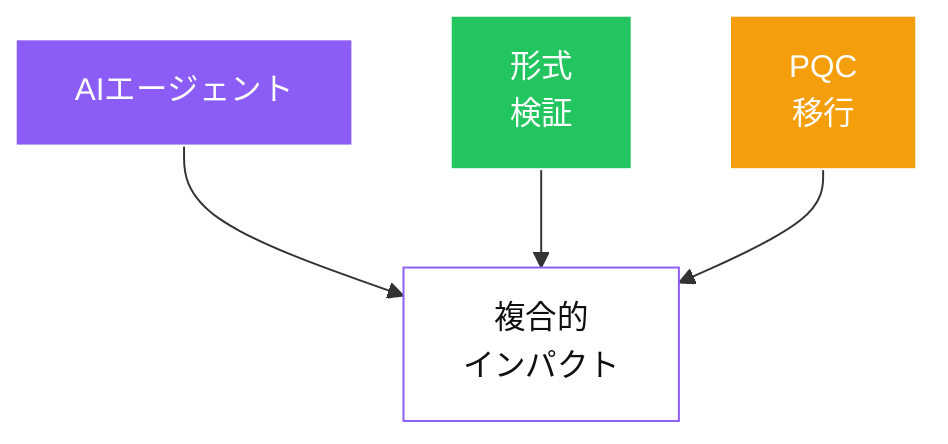

# 収束：各トレンドが互いを増幅する

<!--
Speaker Notes:
ここまで紹介した3つのトレンド——AIエージェント、形式検証、耐量子計算機暗号——は独立した話ではありません。収束し、互いの影響力を増幅しています。考えてみてください：形式検証は強力ですが労力を要します。AIエージェントは補題の提案、証明探索、反例生成といった形式検証の煩雑な部分を自動化できます。PQC移行にはコードベース全体の暗号依存関係の監査と置換の正確性検証が必要です——まさにエージェントが得意とする体系的・網羅的タスクです。SCIS 2026では、LLM支援とプロトコル検証を組み合わせた研究や、移行監査の自動化に取り組むチームなど、分野横断的な研究の萌芽が見えました。重要な洞察は、これらの能力は複合的であるということです。3つの領域すべてを理解する研究者は、1つだけの専門家にはアクセスできない好循環を生み出せます。
-->
