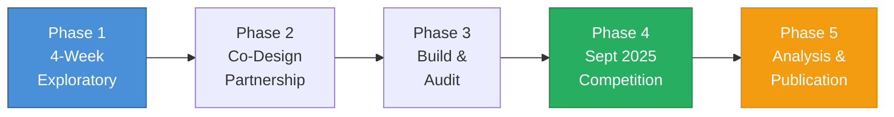

# The phased roadmap starts with 4-week exploratory meetings and leads to a September 2025 competition launch.

<!--
Speaker Notes:
Let me walk you through our proposed roadmap. We are not asking Sony to commit to sponsorship today. We are proposing a phased approach that allows both organizations to validate alignment before committing significant resources. Phase 1 is what we are asking for now: a 4-week series of exploratory meetings to assess strategic fit. This is a low-commitment entry point that allows us to determine whether our goals and capabilities align. If Phase 1 confirms alignment, Phase 2 would be a co-design partnership where Sony contributes to defining competition rules, reward structures, and research priorities. This is where SGE's education expertise and Soneium's ecosystem goals can shape the competition design. Phase 3 is the build phase: developing and security-auditing the competition infrastructure. Phase 4 is the September 2025 competition execution, including live streaming and real-time visualization. Phase 5 is post-competition analysis and research publication—the academic output that creates lasting value. Each phase builds on the previous one, and each has clear milestones and exit criteria.
-->
