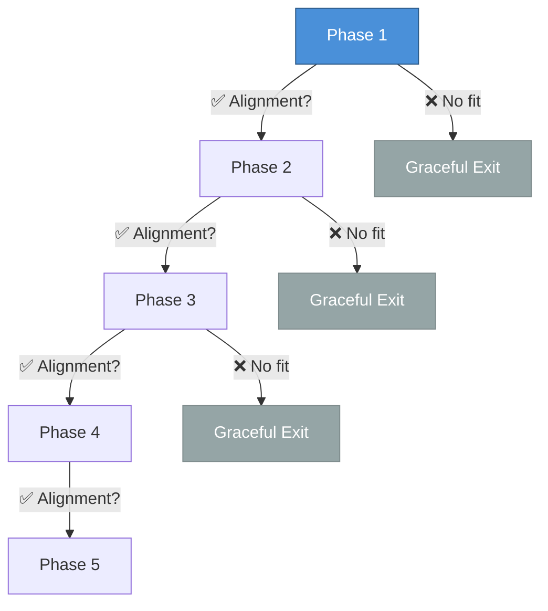

# Clear exit criteria at each phase allow both parties to gracefully disengage if alignment is not confirmed.

<!--
Speaker Notes:
We have intentionally structured this engagement to protect both organizations. Each phase has defined exit criteria, and either party can disengage gracefully at any phase boundary if strategic fit is not confirmed. The Phase 1 exploratory meetings are specifically designed as a low-commitment entry point. If after four weeks of discussion we determine that strategic alignment is not strong enough to justify continued investment, both parties can walk away having invested only meeting time. There is no reputational risk, no sunk cost pressure, no obligation to continue. This structure reflects our genuine interest in finding a partnership that works for both parties, not in pressuring Sony into a commitment that may not serve your strategic interests. If alignment is confirmed, we move forward with increasing commitment. If not, we have both learned something valuable and can pursue other paths. This is how responsible partnerships are built.
-->
