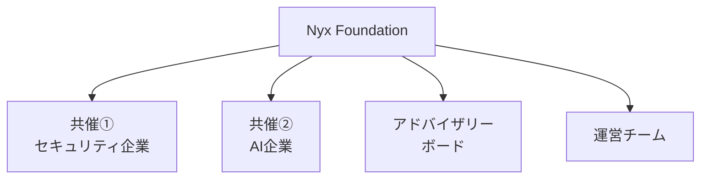

# 運営体制 & ガバナンス

**アドバイザリーボード（5-7名）：** セキュリティ研究（NICT、産総研、大学）/ 法律 / 防衛・安全保障政策 / AI倫理

**ポイント：** 非営利法人主催 + 倫理委員会 + 省庁後援 = **公共性と信頼性の確保**

<!--
Speaker Notes:
運営体制は、公共性と信頼性を最大化する設計です。

主催は非営利型一般社団法人であるNyx Foundationが務めます。共催として、プラットフォーム提供を担うセキュリティ/防衛スタートアップと、スポンサー営業を担うAIスタートアップが参画します。

5〜7名で構成される倫理・技術アドバイザリーボードには、NICTや産総研、大学からのサイバーセキュリティ研究者、サイバーセキュリティ法専門の弁護士、防衛省OBやNISCからの防衛・安全保障政策の専門家、AI Safety研究者が参加します。

運営チームは技術チーム（Nyx Foundation）、渉外チーム（共催②）、広報チームで構成されます。

非営利法人の主催、倫理委員会の設置、省庁の後援という三位一体の体制により、公共性と信頼性を確保しています。
-->
