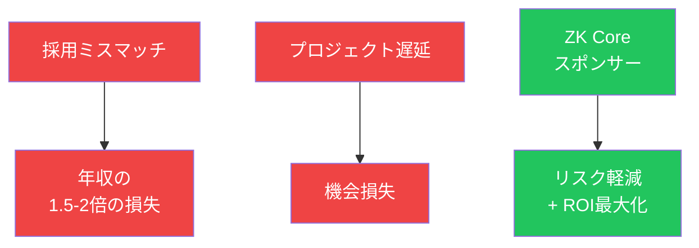

# 採用失敗リスクと機会損失を考慮すれば、投資対効果は圧倒的である

<!--
Speaker Notes:
しかし、真のROIを考えるには、隠れたコストも考慮する必要があります。採用のミスマッチが発生した場合、そのコストは年収の1.5倍から2倍に達すると言われています。再採用のコスト、引継ぎ期間の生産性低下、チームへの影響など、目に見えにくいコストが積み重なるためです。さらに、暗号技術人材の不足によるプロジェクト遅延の機会損失は、計り知れません。競合他社がZKP実装を完了して市場に投入する間、御社のプロジェクトが人材不足で停滞していれば、失われる市場機会は協賛金の何倍にも上ります。ZK Core Programのスポンサーシップでは、7週間のメンタリングを通じて候補者を深く理解してから採用判断ができるため、ミスマッチリスクを大幅に軽減できます。これらの定性的価値を含めた総合ROIを考えれば、スポンサーシップの投資対効果は圧倒的です。
-->
