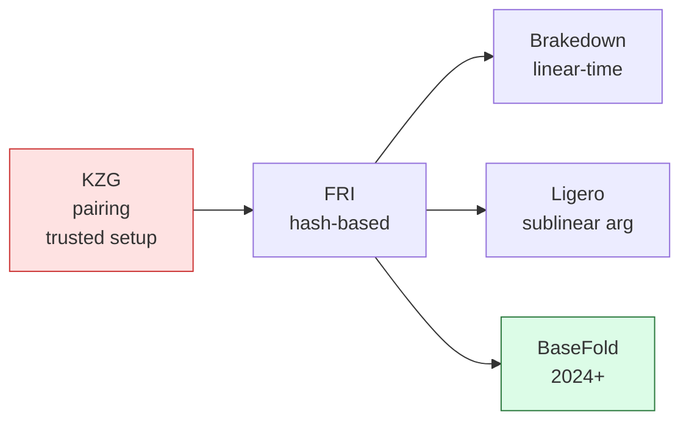
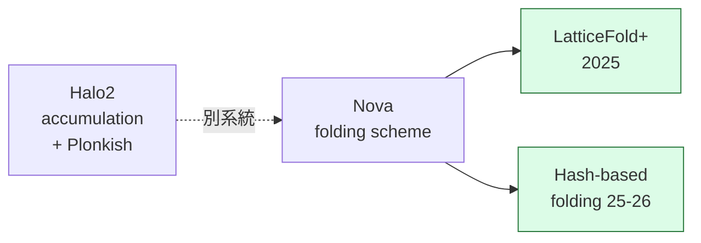

# S2-C ③ コミットメント + Folding の進化 — <strong>trusted setup を捨てる流れ</strong>

### コミットメントの進化

<strong>利点</strong>:
<ul class="list-disc pl-5">
<li>trusted setup 不要 (universal でも避けたい)</li>
<li>量子耐性 (post-quantum)</li>
<li>Blake3 などで <strong>hashing が高速</strong></li>
</ul>

### Folding / IVC の進化 (別系統が並走)

<strong>用途</strong>:
<ul class="list-disc pl-5">
<li><strong>IVC (Incrementally Verifiable Computation)</strong> で「永続的に積み上がる計算」を1つの proof に圧縮</li>
<li>ブロックチェーンの state proof, zkML の長い推論</li>
</ul>

<strong>まとめ</strong>: 「証明系」「コミットメント」「合成 (folding)」の3つが同時に hash-based / setup-free に動いている。<strong>10年前の SNARK の常識は通用しない</strong>。

Sources: Ben-Sasson et al. "Brakedown" CRYPTO 2023 ｜ Ames et al. "Ligero" CCS 2017 ｜ Kothapalli, Setty "Nova" CRYPTO 2022 ｜ Bünz, Chen "LatticeFold+" eprint 2025/247 ｜ BaseFold (Zeilberger et al. 2024)

<!--
Speaker Notes:
証明系を補強する2つの軸、コミットメントと folding の進化を見ます。左がコミットメントの系譜です。KZG は pairing ベースで trusted setup が要ります。これは脆弱性ではないですが、運用上の手間が大きい。FRI は hash-based で、trusted setup が要りません。Brakedown は linear-time、Ligero は sublinear argument、BaseFold が2024年以降の方向です。利点は3つ。trusted setup 不要、量子耐性、そして Blake3 などで hashing が高速で実用速度が出ます。右が folding の系譜です。Halo2 が recursion、Nova が folding scheme という新しい概念、その先に LatticeFold+ と hash-based folding が来ています。用途は IVC、incrementally verifiable computation で、永続的に積み上がる計算を1つの proof に圧縮できます。ブロックチェーンの state proof や、zkML の長い推論などに直結する技術です。まとめると、証明系、コミットメント、合成という3つの軸が、同時に hash-based / setup-free の方向に動いている。10年前の SNARK の常識は通用しません。
-->
