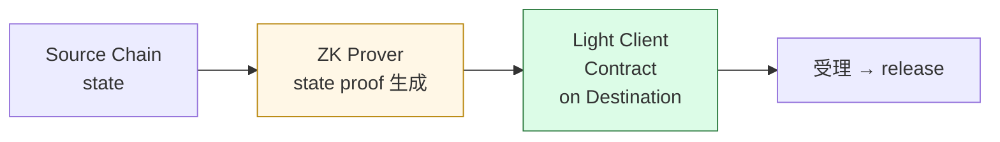

# S2-C ⑤ ZK Bridge / Light Client — <strong>KelpDAO の事件は ZK で防げたか?</strong>

### 仕組み

source chain の状態を <strong>ZK proof</strong> として送り、destination 側の light client コントラクトが <strong>暗号的に検証</strong>する。
<strong>RPC ノードの信頼に依存しない</strong>。

### 代表実装の比較

<table class="text-xs mt-1">
<thead>
<tr><th></th><th>Polyhedra zkBridge</th><th>Succinct Telepathy</th></tr>
</thead>
<tbody>
<tr><td>証明系</td><td>Sumcheck 系</td><td>SP1 (zkVM)</td></tr>
<tr><td>対応 chain</td><td><strong>汎用</strong> (多 chain)</td><td>Ethereum 中心</td></tr>
<tr><td>強み</td><td>軽い proof</td><td>標準的な zkVM 開発体験</td></tr>
<tr><td>トレードオフ</td><td>汎用性 vs 最適化</td><td>最適化 vs 汎用性</td></tr>
</tbody>
</table>

🟡 <strong>ホワイトボードへの種</strong>:  
"ZK light client なら、source chain の RPC が同じく侵害されたらどう?" — 午後の議論で扱う。

Sources: Polyhedra Network "zkBridge" technical paper (2022-) ｜ Succinct Labs "SP1 + Telepathy" docs (2024-)

<!--
Speaker Notes:
ZK Bridge、または ZK light client です。これは午後のホワイトボードセッションで議論する KelpDAO の事件と直結します。仕組みは左の図です。source chain の状態を ZK proof として生成し、destination chain の light client コントラクトが暗号的に検証する。これによって、RPC ノードの信頼に依存せずに cross-chain メッセージを検証できます。KelpDAO は RPC ノードを侵害されました。ZK light client なら、RPC が嘘をついていても proof が検証に通らないので、原理的にこの攻撃は止まります。代表実装は Polyhedra zkBridge と Succinct Telepathy です。Polyhedra は Sumcheck 系の証明で、複数の chain に対応する汎用設計です。Succinct は SP1 という zkVM ベースで、Ethereum 中心の最適化が強い。トレードオフは汎用性と最適化の対立です。ただし、ホワイトボードへの種として、皆さんに考えてほしい問いがあります。「ZK light client にしても、source chain の RPC が同じく侵害されたらどうなるか」。これは午後の講師の突っ込み弾の1つで、答えは決まっていません。
-->
